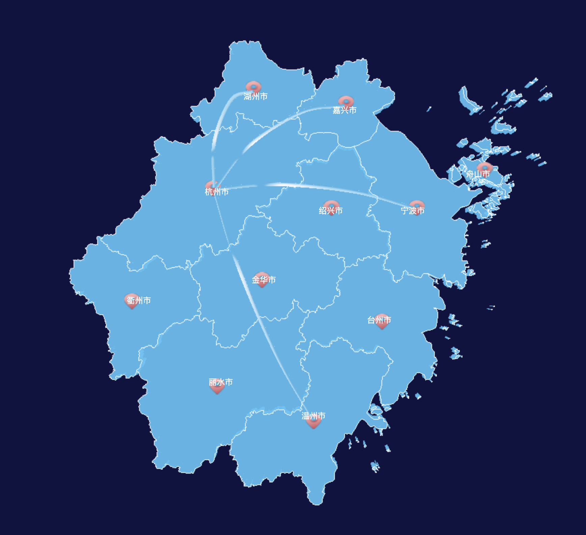

# V3Map
### Javascript三维地图库

本项目的目的是打造一款可以通过简单轻量化配置就可以快速上手的三维地图工具库。目前本工具库底层基于[three.js](https://threejs.org/) Javascript 三维库实现。



## 常规使用
```
import { V3Map } from "v3map";

const dataSource = v3map_data_source;
const configuration = {
    depth: 0.2,
    border: {
        show: true
    },
    dataLabel: {
        show: true,
        style: {
            color: "white",
            fontSize: "12px",
        }
    },
    dataMark: {
        show: true,
        url: "../assets/icon.png",
        scale: 0.4
    },
    light: {
        show: true,
        url: "../assets/flow.png",
        weight: 0.03,
        series: [
            {
                start: 330200,
                end: 330100
            },
            {
                start: 330300,
                end: 330100
            },
            {
                start: 330400,
                end: 330100
            },
            {
                start: 330500,
                end: 330100
            }
        ]
    },
    events: {
        select: {
            onSelect: () => { },
            depthDelta: 0.2,
            boder: {
                color: 0xff0000,
                weight: 2
            }
        }
    }

};


const map = new V3Map(configuration, dataSource);
map.render(document.getElementById("map"));
```

1. v3map_data_source 是绘制三维地图需要的地图经纬度坐标数据。具体参考事例里的资源文件夹中找到。
2. configuration是设置三维地图渲染的配置项，包括三维地图的整体选项以及边框，文本标签，图标表示，流光动画以及事件处理等。
3. 地图渲染需要指定在HTML页面的容器。

## Distribution使用
V3Map默认包含了打包版本。只需要在HTML页面中通过常规Javascript脚本引入的方式引入V3Map的分发脚本。默认分发脚本在dist目录下可以找到。

### 引入脚本
在页面中需要引入如下three.bundle.js和v3map.bundle.js脚本。
```
 <script type="text/javascript" src="dist/three.bundle.js"></script>
    <script type="text/javascript" src="dist/v3map.bundle.js"></script>
```

### 创建地图
引入脚本后，就可以直接使用V3Map对象进行地图构建。详细用法请见import使用。
```
const map = new V3Map(configuration, dataSource);
map.render(document.getElementById("map"));
```

## Examples
V3Map提供了诺干个事例，包括如何设置边框，文本标签，图标，流光动线以及事件等。具体事例请查看examples目录。如果需要查看事例，可以运行下面的命令启动vite。
`npx vite`

## 配置文档
[API文档](./docs/V3Map%E9%85%8D%E7%BD%AE%E8%AF%B4%E6%98%8E.md)请查看docs目录，希望能对你有所帮助。


2023年11月12日


